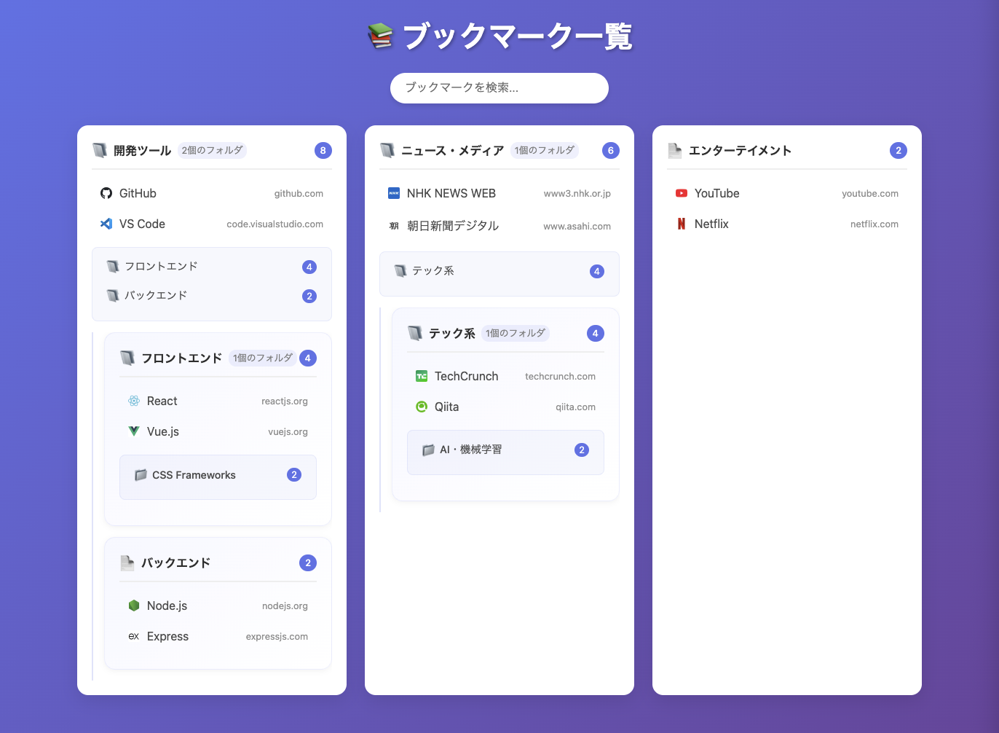

# Chrome Bookmark List

新しいタブでブックマークをフォルダ別に一覧表示するChrome拡張機能



## 機能

- 📁 ブックマークをフォルダ別にグループ表示
- 🔄 フォルダの展開・折りたたみ機能
- 📊 階層構造の表示（親フォルダ→子フォルダ）
- 🔍 リアルタイム検索機能（検索時は自動展開）
- ✏️ **ブックマーク編集機能**（名前変更・URL変更・フォルダ移動）
- 🗑️ **ブックマーク削除機能**（確認ダイアログ付き）
- 🎨 モダンで美しいUI
- ⚡ 高速なブックマークアクセス
- 📱 レスポンシブデザイン（1600px以上で3カラム表示）
- 🖼️ Favicon表示とキャッシュ機能
- 🔒 プライバシー重視（外部APIサービス不使用）

## ディレクトリ構造

```
chrome-bookmark-list/
├── src/                         # TypeScriptソースファイル
│   ├── components/              # コンポーネントアーキテクチャ（v1.4.0+）
│   │   ├── BookmarkFolder/      # フォルダー関連コンポーネント
│   │   │   ├── BookmarkFolderRenderer.ts    # HTML生成
│   │   │   ├── BookmarkFolderEvents.ts      # イベント処理
│   │   │   └── index.ts                     # 統合インターフェース
│   │   ├── BookmarkItem/        # アイテム関連コンポーネント
│   │   │   └── BookmarkItemRenderer.ts      # アイテムHTML生成
│   │   └── BookmarkActions/     # アクション機能
│   │       ├── BookmarkEditor.ts            # 編集機能
│   │       ├── BookmarkDeleter.ts           # 削除機能
│   │       └── index.ts                     # 統合クラス
│   ├── types/                   # 強化された型定義
│   │   ├── bookmark.ts          # ブックマーク関連型
│   │   ├── events.ts            # イベント関連型
│   │   └── index.ts             # 統合エクスポート
│   ├── scripts/                 # スクリプトファイル
│   │   ├── newtab.ts            # メインエントリーポイント
│   │   ├── newtab-core.ts       # リファクタリング済みコア機能
│   │   ├── types.ts             # レガシー型定義（後方互換性）
│   │   └── utils.ts             # ユーティリティ関数
│   ├── manifest.json            # 拡張機能マニフェスト
│   ├── newtab.html              # 新しいタブページHTML
│   ├── styles.css               # スタイルシート
│   └── icons/                   # アイコンファイル
├── test/                        # テストファイル
│   ├── setup.ts                 # テスト設定
│   ├── utils.test.ts            # ユーティリティテスト（23テスト）
│   ├── bookmark-delete.test.ts  # 削除機能テスト（6テスト）
│   ├── bookmark-edit.test.ts    # 編集機能テスト（9テスト）
│   ├── integration.test.ts      # 統合テスト（7テスト）
│   ├── newtab-integration.test.ts # フォルダクリックテスト（13テスト）
│   ├── newtab.test.ts           # 基本機能テスト（3テスト）
│   └── 3layer-issues.test.ts    # 深い階層テスト（4テスト）
├── docs/                        # ドキュメント
│   ├── internal-specification.md # 内部仕様書
│   ├── external-specification.md # 外部仕様書
│   └── TESTING_GUIDE.md         # テストガイド
├── dist/                        # ビルド成果物（拡張機能用）
├── build.sh                     # ビルドスクリプト
├── package.json                 # Node.js依存関係
├── tsconfig.json                # TypeScript設定
├── vitest.config.ts             # テスト設定
├── screenshot.png               # スクリーンショット
└── README.md                    # このファイル
```

## インストール方法

### 1. リポジトリのクローンと依存関係のインストール
```bash
git clone <このリポジトリのURL>
cd chrome-bookmark-list
npm install
```

### 2. プロジェクトのビルド
```bash
npm run build:extension
```

### 3. Chrome拡張機能として読み込み
1. Chromeで `chrome://extensions/` を開く
2. 右上の「デベロッパーモード」を有効にする
3. 「パッケージ化されていない拡張機能を読み込む」をクリック
4. **`dist`フォルダ**を選択（ビルド成果物が含まれています）
5. 新しいタブを開くと、ブックマーク一覧が表示されます

## 使用方法

1. 新しいタブを開く
2. ブックマークがフォルダ別に階層表示される
3. **サブフォルダの確認**: 各フォルダ内に薄紫色の背景でサブフォルダ一覧を表示
4. **サブフォルダの展開**: 📁アイコン付きのサブフォルダ名をクリックして内容を展開・折りたたみ
5. **ブックマークを開く**: ブックマークをクリックして新しいタブでページを開く
6. **ブックマーク編集**: ✏️ 編集ボタンで名前・URL・フォルダを変更
7. **ブックマーク削除**: 🗑️ 削除ボタンで不要なブックマークを削除（確認ダイアログ付き）
8. **検索**: 検索バーでブックマークタイトルやURLを素早く検索（検索時は関連フォルダが自動展開）

## 開発

このプロジェクトは以下の技術を使用しています：

- **TypeScript** - 型安全なJavaScript開発
- **Vitest** - 高速なテストフレームワーク（ユニットテスト・統合テスト）
- **Manifest V3** - 最新のChrome拡張機能仕様
- **Vanilla JavaScript/TypeScript** - フレームワークを使用しない軽量実装
- **CSS Grid & Flexbox** - モダンなレイアウト
- **Chrome Bookmarks API** - ブックマークデータへのアクセス
- **Happy DOM** - テスト環境でのDOM操作
- **JSDOM** - 統合テスト用のDOM環境

### 開発コマンド

- `npm run build` - TypeScriptをコンパイル
- `npm run build:extension` - 拡張機能をビルド（dist/フォルダに出力）
- `npm run dev` - TypeScriptの監視モード（ファイル変更時に自動再コンパイル）
- `npm run clean` - ビルド成果物をクリーンアップ

### テストコマンド

- `npm test` - Vitestでテストを実行（監視モード）
- `npm run test:run` - テストを一度だけ実行
- `npm run test:coverage` - カバレッジレポートを生成
- `npm run test:ui` - Vitestの可視化UIでテストを実行

## TypeScript化について

このプロジェクトはJavaScriptからTypeScriptに移植されました。主な改善点：

- **型安全性**: 実行時エラーを減らし、開発時にバグを発見
- **IntelliSense**: エディタでの自動補完とドキュメント表示
- **リファクタリング支援**: 安全な変数名変更や構造変更
- **モダンな開発環境**: 最新のJavaScript機能を安全に使用

### アーキテクチャ（v1.4.0+）

このプロジェクトは **コンポーネントベースアーキテクチャ** にリファクタリングされました：

#### コンポーネント設計
- **BookmarkFolder**: フォルダーのレンダリングとイベント処理
- **BookmarkItem**: ブックマークアイテムのHTML生成
- **BookmarkActions**: 編集・削除機能の統合

#### 型定義の強化
- **bookmark.ts**: ブックマーク関連の型（`BookmarkItem`, `BookmarkFolder`, `BookmarkUpdateData`等）
- **events.ts**: イベント関連の型（`BookmarkClickEventData`, `FolderToggleEventData`等）
- **後方互換性**: 既存のAPIを維持しながら新しいコンポーネントを導入

### テスト

プロジェクトには包括的なテストスイートが含まれています：

#### ユニットテスト
- **utils.test.ts** (23テスト): データ処理関数、検索・フィルタリング、Faviconキャッシュ
- **bookmark-delete.test.ts** (6テスト): 削除機能の包括的テスト
- **bookmark-edit.test.ts** (9テスト): 編集機能の包括的テスト

#### 統合テスト
- **integration.test.ts** (7テスト): Chrome API連携とDOM操作
- **newtab-integration.test.ts** (13テスト): フォルダクリック機能の詳細テスト
- **newtab.test.ts** (3テスト): 基本機能の動作確認
- **3layer-issues.test.ts** (4テスト): 深い階層の特殊ケース

#### テスト環境
- **Vitest**: 高速なテストランナー（**総計65テスト**）
- **Happy DOM**: 軽量なDOM環境
- **JSDOM**: 完全なDOM環境（統合テスト用）
- **Chrome API モック**: 拡張機能API のシミュレーション

#### リファクタリング後のテスト戦略
- **後方互換性テスト**: 既存のAPIが正常に動作することを確認
- **コンポーネント別テスト**: 各コンポーネントクラスの独立テスト
- **統合テスト**: コンポーネント間の連携テスト

テストカバレッジレポートは `coverage/index.html` で確認できます。

## CI/CD

このプロジェクトにはGitHub Actionsを使用した自動化されたCI/CDパイプラインが設定されています。

### GitHub Actions ワークフロー

- **トリガー**: `main`と`develop`ブランチへのプッシュ、`main`ブランチへのプルリクエスト
- **Node.js バージョン**: 18, 20, 22でのマトリックステスト
- **実行内容**:
  1. **テスト**: すべてのユニットテスト・統合テストを実行
  2. **カバレッジ**: テストカバレッジレポートを生成（Node.js 20のみ）
  3. **ビルド**: TypeScriptのコンパイルと拡張機能のビルド
  4. **型チェック**: TypeScriptの静的型チェック
  5. **アーティファクト**: ビルドされた拡張機能をGitHub Actionsアーティファクトとして保存

### ローカル開発での検証

```bash
# すべてのテストを実行
npm run test:run

# TypeScriptの型チェック
npx tsc --noEmit

# 拡張機能をビルド
npm run build:extension
```

## ライセンス

Apache License 2.0 - 詳細は [LICENSE](LICENSE) ファイルを参照してください。
