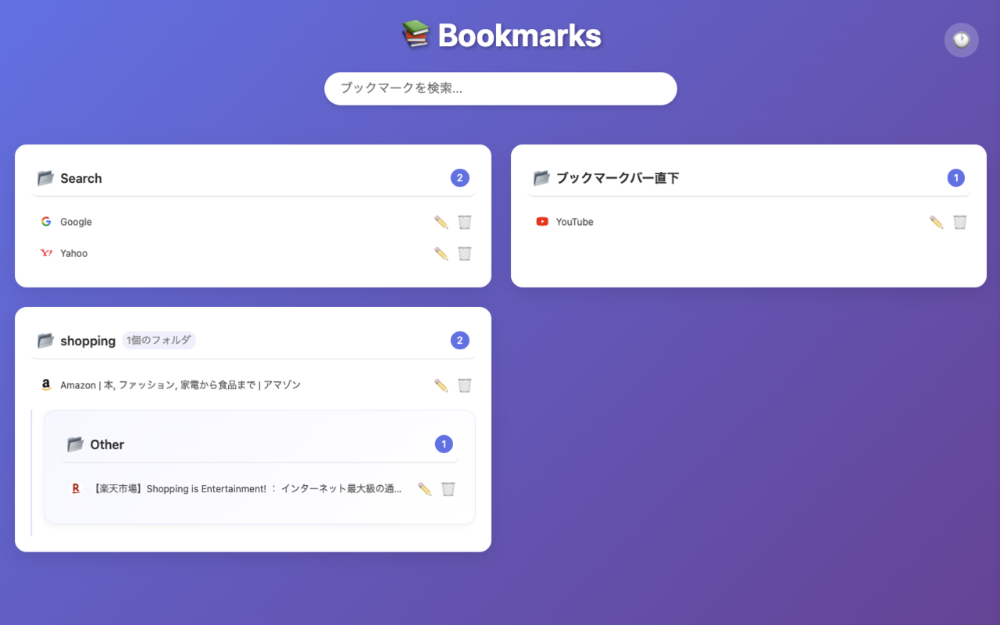
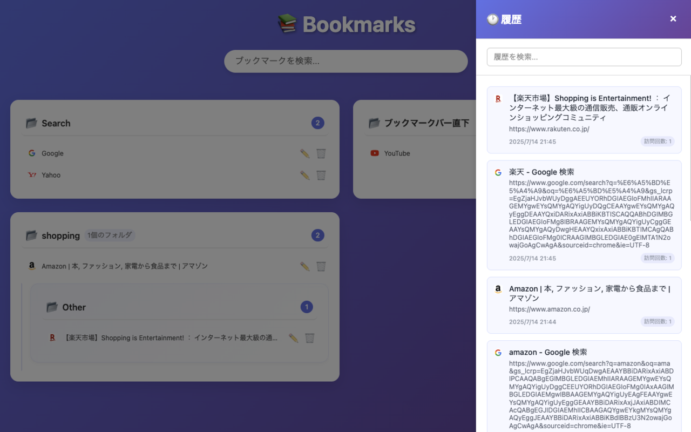

# Chrome Bookmark List

新しいタブでブックマークをフォルダ別に一覧表示し、履歴も検索できるChrome拡張機能




## 機能

- 📁 ブックマークをフォルダ別にグループ表示
- 🔄 フォルダの展開・折りたたみ機能
- 📊 階層構造の表示（親フォルダ→子フォルダ）
- 🔍 リアルタイム検索機能（検索時は自動展開）
- ✏️ **ブックマーク編集機能**（名前変更・URL変更・フォルダ移動）
- 🗑️ **ブックマーク削除機能**（確認ダイアログ付き）
- 🕐 **履歴サイドバー**（過去7日間の履歴を表示・検索可能）
- 🎨 モダンで美しいUI
- ⚡ 高速なブックマークアクセス
- 📱 レスポンシブデザイン（1600px以上で3カラム表示）
- 🖼️ Favicon表示とキャッシュ機能
- 🔒 プライバシー重視（外部APIサービス不使用）


## インストール方法

### 1. リポジトリのクローンと依存関係のインストール
```bash
git clone <このリポジトリのURL>
cd chrome-bookmark-list
npm install
```

### 2. プロジェクトのビルド
```bash
npm run build:extension
```

### 3. Chrome拡張機能として読み込み
1. Chromeで `chrome://extensions/` を開く
2. 右上の「デベロッパーモード」を有効にする
3. 「パッケージ化されていない拡張機能を読み込む」をクリック
4. **`dist`フォルダ**を選択（ビルド成果物が含まれています）
5. 新しいタブを開くと、ブックマーク一覧が表示されます

## 使用方法

1. 新しいタブを開く
2. ブックマークがフォルダ別に階層表示される
3. **サブフォルダの確認**: 各フォルダ内に薄紫色の背景でサブフォルダ一覧を表示
4. **サブフォルダの展開**: 📁アイコン付きのサブフォルダ名をクリックして内容を展開・折りたたみ
5. **ブックマークを開く**: ブックマークをクリックして新しいタブでページを開く
6. **ブックマーク編集**: ✏️ 編集ボタンで名前・URL・フォルダを変更
7. **ブックマーク削除**: 🗑️ 削除ボタンで不要なブックマークを削除（確認ダイアログ付き）
8. **検索**: 検索バーでブックマークタイトルやURLを素早く検索（検索時は関連フォルダが自動展開）
9. **履歴サイドバー**: 右上の🕐ボタンで履歴サイドバーを開き、過去7日間の履歴を閲覧・検索

## ライセンス

Apache License 2.0 - 詳細は [LICENSE](LICENSE) ファイルを参照してください。
