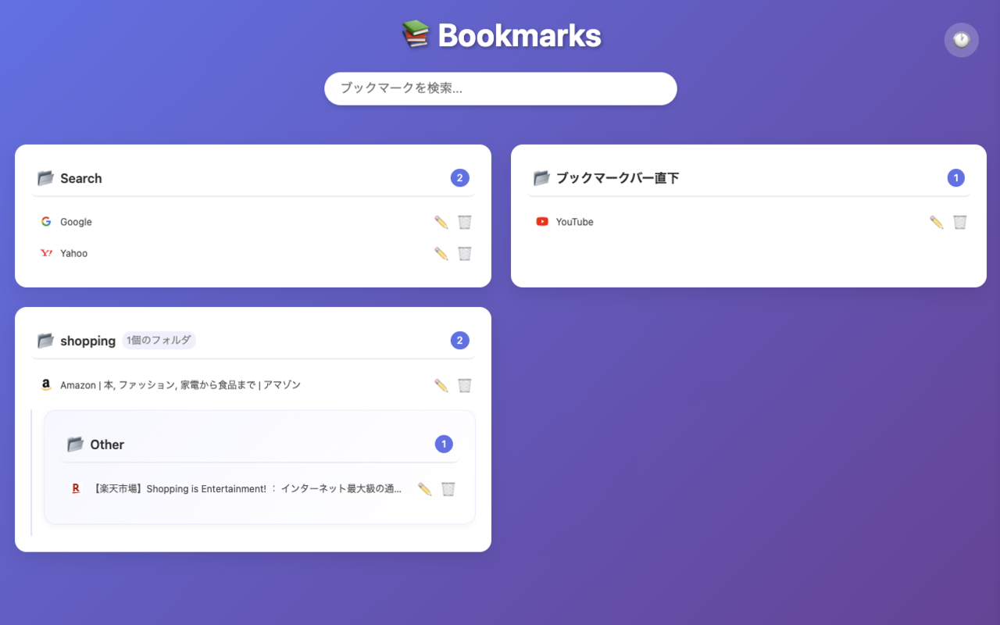
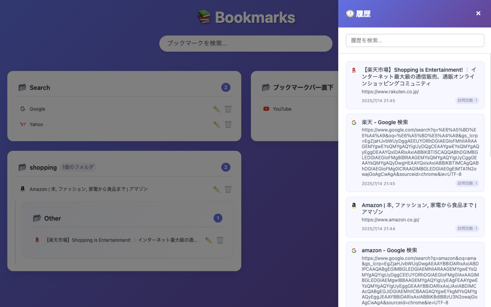

# Chrome Bookmark List

新しいタブでブックマークをフォルダ別に一覧表示し、履歴も検索できるChrome拡張機能




## 機能

- 📁 ブックマークをフォルダ別にグループ表示
- 🔄 フォルダの展開・折りたたみ機能
- 📊 階層構造の表示（親フォルダ→子フォルダ）
- 🔍 リアルタイム検索機能（検索時は自動展開）
- ✏️ **ブックマーク編集機能**（名前変更・URL変更・フォルダ移動）
- 🗑️ **ブックマーク削除機能**（確認ダイアログ付き）
- 🖱️ **ドラッグ&ドロップ機能**（ブックマークを直感的にフォルダ間で移動）
- 🕐 **最近の履歴**（過去7日間の履歴を表示・検索可能）
- 🗂 **最近閉じたタブ**（一覧表示・クリックで元の位置に復元）
- 📅 **カレンダー履歴**（当月の履歴を日別・時間別に表示、ドメイン統計機能付き）
- 🎨 モダンで美しいUI
- ⚡ 高速なブックマークアクセス
- 📱 レスポンシブデザイン（1600px以上で3カラム表示）
- 🖼️ Favicon表示（Chrome の `_favicon` API によるローカル取得、外部通信なし）
- 🔒 プライバシー重視（外部APIサービス不使用）


## インストール方法

### 1. リポジトリのクローンと依存関係のインストール
```bash
git clone <このリポジトリのURL>
cd chrome-bookmark-list
npm install
```

### 2. プロジェクトのビルド
```bash
npm run build:extension
```

### 3. Chrome拡張機能として読み込み
1. Chromeで `chrome://extensions/` を開く
2. 右上の「デベロッパーモード」を有効にする
3. 「パッケージ化されていない拡張機能を読み込む」をクリック
4. **`dist`フォルダ**を選択（ビルド成果物が含まれています）
5. 新しいタブを開くと、ブックマーク一覧が表示されます

## 使用方法

1. 新しいタブを開く
2. ヘッダーのタブナビゲーション（📚 ブックマーク / 🕐 最近の履歴 / 🗂 最近閉じたタブ / 📅 カレンダー）で表示を切り替える
3. **サブフォルダの確認**: 各フォルダ内に薄紫色の背景でサブフォルダ一覧を表示
4. **サブフォルダの展開**: 📁アイコン付きのサブフォルダ名をクリックして内容を展開・折りたたみ
5. **ブックマークを開く**: ブックマークをクリックして新しいタブでページを開く
6. **ブックマーク編集**: ✏️ 編集ボタンで名前・URL・フォルダを変更
7. **ブックマーク削除**: 🗑️ 削除ボタンで不要なブックマークを削除（確認ダイアログ付き）
8. **ドラッグ&ドロップ**: 🖱️ ブックマークをドラッグして別のフォルダにドロップすることで移動
9. **検索**: 検索バーでブックマークタイトルやURLを素早く検索（検索時は関連フォルダが自動展開）
10. **最近の履歴**: 🕐タブをクリックして過去7日間の履歴を閲覧・検索
11. **最近閉じたタブ**: 🗂タブをクリックして閉じたタブ一覧を表示。クリックで元の位置に復元
12. **カレンダー履歴**: 📅タブをクリックして当月の履歴を日別・時間別に閲覧
    - カレンダーで日付を選択すると、その日の履歴が時間単位（1時間ごと）で表示
    - 各時間帯のドメイン別訪問統計を表示（Favicon付き）
    - 時間単位のナビゲーションリンクで素早く該当時間にジャンプ
    - 検索機能で履歴を絞り込み可能

## ライセンス

Apache License 2.0 - 詳細は [LICENSE](LICENSE) ファイルを参照してください。
